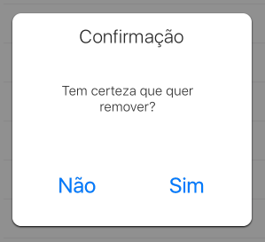

ETAlertView
========
Sometimes Apple's stock UIAlertView doesn't give you enough flexibility to change some of its design, so **ETAlertView** is a simple popup that allows you to change anything you want.

Installation
--------
Clone this repo and copy the folder **ETAlertView** into your Xcode project.

How-to
--------



### Programmatically

Programmatically, just use the following method:

```
- (id)initWithTitle:(NSString *)title message:(NSString *)message confirmationButtonTitle:(NSString *)confirmationButtonTitle;
- (id)initWithTitle:(NSString *)title message:(NSString *)message confirmationButtonTitle:(NSString *)confirmationButtonTitle confirmationBlock:(void (^)(void))confirmationBlock;
- (id)initWithTitle:(NSString *)title message:(NSString *)message negativeButtonTitle:(NSString *)negativeButtonTitle positiveButtonTitle:(NSString *)positiveButtonTitle;
- (id)initWithTitle:(NSString *)title message:(NSString *)message negativeButtonTitle:(NSString *)negativeButtonTitle positiveButtonTitle:(NSString *)positiveButtonTitle negativeBlock:(void (^)(void))negativeBlock positiveBlock:(void (^)(void))positiveBlock;
```

And then show it onscreen:

```
[alertView show];
```

### Example

There are some delegates you can implement as callbacks:

```
        // Alert message
        [[[ETAlertView alloc] initWithTitle:NSLocalizedString(@"Confirmation", nil) message:NSLocalizedString(@"Are you sure you want to remove it?", nil) negativeButtonTitle:NSLocalizedString(@"No", nil) positiveButtonTitle:NSLocalizedString(@"Yes", nil) negativeBlock:nil positiveBlock:^{
            // Commands and requests
        }] show];
```

### Getters

There are some properties you can have access to. Accessible at anytime, just KVO them. 

- `@property (strong, nonatomic) IBOutlet UIView *masterView;`
- `@property (strong, nonatomic) IBOutlet UIView *box;`
- `@property (strong, nonatomic) IBOutlet UILabel *title;`
- `@property (strong, nonatomic) IBOutlet UIView *messageBox;`
- `@property (strong, nonatomic) IBOutlet UIButton *message;`
- `@property (strong, nonatomic) IBOutlet UIButton *leftButton;`
- `@property (strong, nonatomic) IBOutlet UIButton *rightButton;`

Support
--------
Just open an issue on Github and we'll get to it as soon as possible.

About
--------
**ETAlertView** is brought to you by Trilha.
